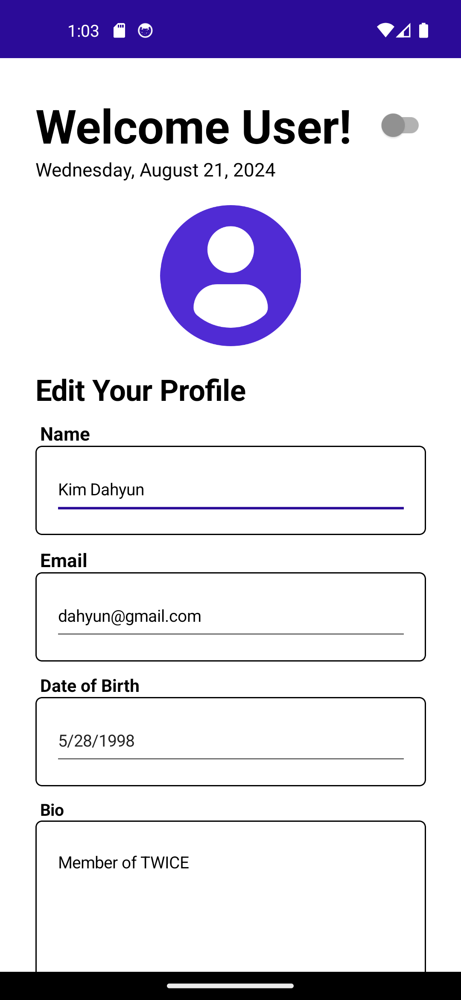
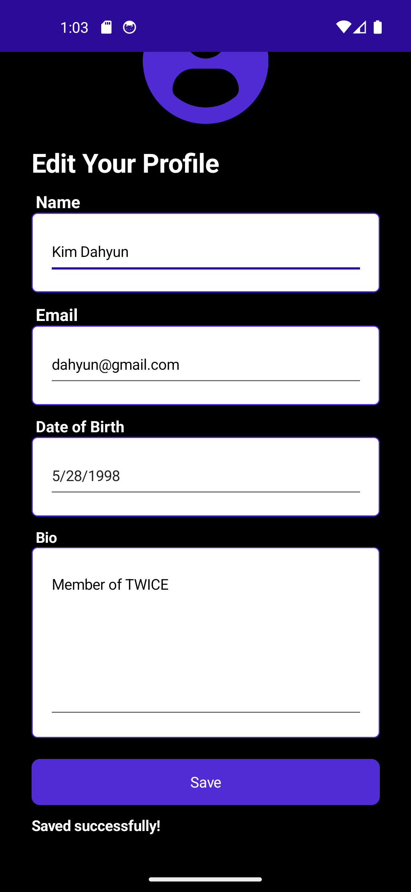

# Module 01 - Exercise 01 (PDC50-LAB)

    Name of Student: Elmalia Jane S. Diaz
    Year and Section: BSIT4A
    Activity Title: Module 01 - Exercise 01
    Date Submitted: August 21, 2024

## User Profile Management Form
### Source Code
- [MainPage.xaml](Module01Exercise01/MainPage.xaml)
- [MainPage.xaml.cs](Module01Exercise01/MainPage.xaml.cs)
- [CurrentDateExtension.cs](Module01Exercise01/CurrentDateExtension.cs)

## Light Mode (Not Saved)
### Output Screenshots

    
    

## Dark Mode (Not Saved)
### Output Screenshots

    
    

## Light Mode (Saved)
### Output Screenshots

    
    

## Dark Mode (Saved)
### Output Screenshots

    
    

